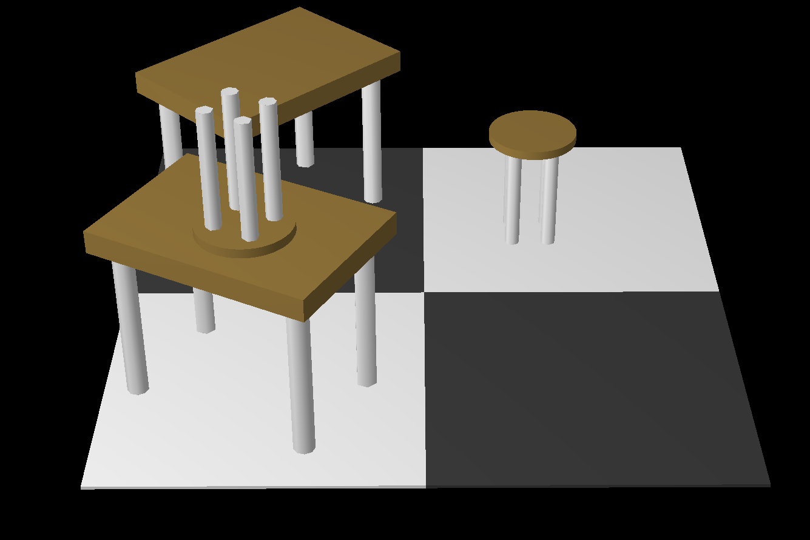
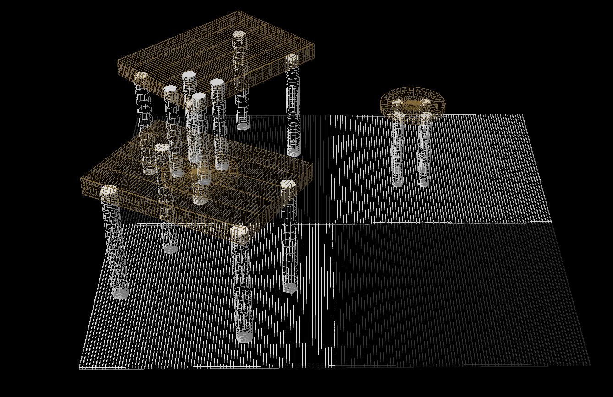
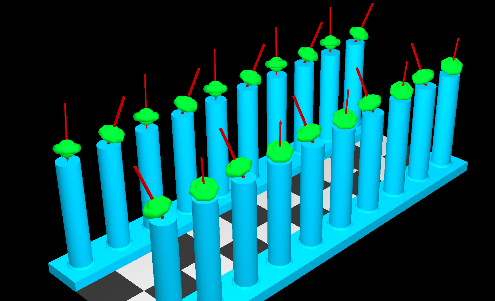
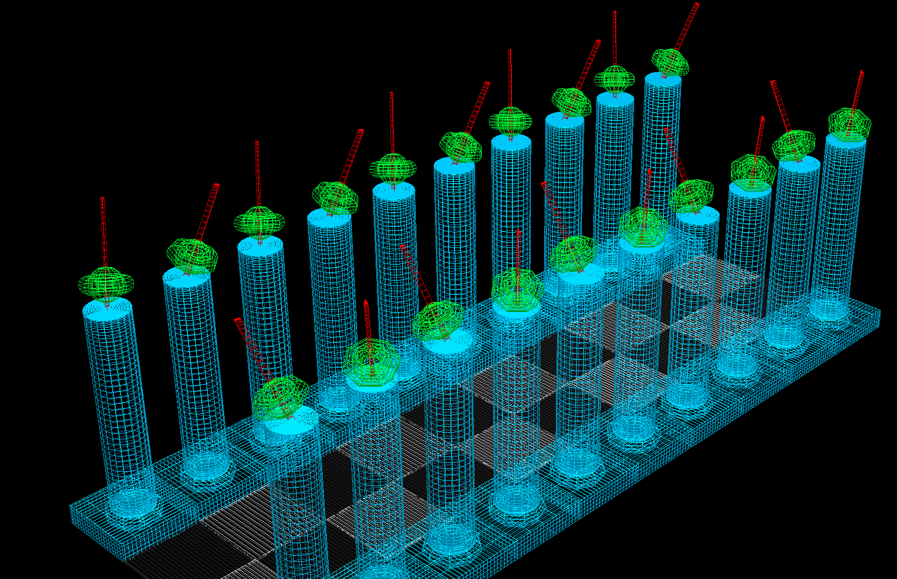

# M1 Informatique - Synthèse Image
Thomas DUMONT - Estelle GUYOT
 
## Compilation du projet
 
Pour lancer le projet, il suffit de taper la commande : `make`
 
Pour lancer une scène, il faut taper la commande : `./<nomDeScene>`
 
Pour nettoyer le dossier (supprimer les *.o et les scènes) `make clean`
 
## Description du travail fourni
 
### 0. Modélisation des formes canoniques
 
Nous avons réalisé les différentes canoniques demandé tels que :
- le cube
- la sphère
- le cylindre
- le tore
- le cône
 
Afin de réaliser ces formes, nous avons implémenté leurs formules mathématiques de sorte qu'elle puisse avoir une résolution adaptative.
 
### 1. Affichage des instances
 
Étant parti sur des quads, nous pourrions améliorer le code en utilisant des triangles, car cela réduirait la duplication de point au niveau des pôles de la sphère et au centre des faces du cylindre et du cône. De plus, nous avons un affichage par point.
 
### 2. Arbres de scène & transformations géométriques
 
Pour ce point du projet, tout ce qui a été demandé a été fait. Mais afin de faciliter la création des nœuds et des arbres, plusieurs fonctions ont été établi et un workflow c'est imposé :
1. Initialiser chaque nœud de l'arbre \
*Extrait de la scène 1 - gl_damier*
```c
Node *ground = init_node();
Node *sq1 = init_node();
Node *sq2 = init_node();
Node *sq3 = init_node();
Node *sq4 = init_node();
```
2. Création des liens frères ou fils entre les nœuds
*Extrait de la scene1 - gl_damier*
```c
set_down(ground, sq1);
set_down(sq1, sq2);
set_next(sq1, sq3);
set_down(sq3, sq4);
```
3. Initialisation de la couleur, du matérial et de l'instance des nœuds
 
*Extrait de la scène 1 - gl_damier*
```c
G3Xcolor col1 = (G3Xcolor){0.8, 0.8, 0.8, 1.};
G3Xcolor col2 = (G3Xcolor){0.2, 0.2, 0.2, 1.};
 
set_material_and_instance(sq1, col1, mat, cube_can);
set_material_and_instance(sq2, col1, mat, cube_can);
set_material_and_instance(sq3, col2, mat, cube_can);
set_material_and_instance(sq4, col2, mat, cube_can);
```
 
4. On applique les transformations sur les nœuds
 
*Extrait de la scène 1 - gl_damier*
```c
set_Homothetie3d(ground, 1., 1., 0.01);
 
set_translation3d(sq1, 1., 1., 0.);
set_translation3d(sq2, -2., -2., 0.);
set_translation3d(sq3, 1., -1., 0.);
set_translation3d(sq4, -2., 2., 0.);
```
 
5. On retourne la racine de l'arbre
 
*Extrait de la scène 1 - gl_damier*
```c
return ground;
```
 
Lorsqu'on applique une homothétie sur un nœud, nous mettons bien à jour le scale factor du nœud et des fils du nœud.
 
```c
void set_Homothetie3d(Node *node, double x, double y, double z)
{
    *(node->Md) = g3x_Mat_x_Mat(*(node->Md), g3x_Homothetie3d(x, y, z));
    update_scale_factor(node, *(node->scale_factor));
}
 
void update_scale_factor(Node *node, G3Xvector daddy_scale_factor)
{
    *(node->scale_factor) = g3x_Mat_x_Vector(*(node->Md), daddy_scale_factor);
    if (node->down != NULL)
    {
        update_scale_factor(node->down, *(node->scale_factor));
    }
    if (node->next != NULL)
    {
        update_scale_factor(node->next, daddy_scale_factor);
    }
}
```
 
### 3. Adaptation dynamique : prise en compte des positions relatives Objet/Caméra
 
Afin de mettre en place l'adaptation dynamique nous sommes parti sur la seconde implémentation proposé c'est-à-dire d'utiliser les coordonnés x,y,z contenu dans la matrice de transformation local du noeud. Ainsi, lors de l'affichage de l'instance d'un noeud nous passons sa matrice de transformation dans une fonction qui va nous retourné la distance entre le noeud et la caméra :
 
```c
double compute_cam_node_distance(G3Xhmat Md)
{
    G3Xpoint node_pos = (G3Xpoint){Md.m[12], Md.m[13], Md.m[14]};
    G3Xpoint cam_pos = *(g3x_GetCamera()->pos);
 
    return 1. / (sqrt(pow((node_pos.x - cam_pos.x), 2.) + pow((node_pos.y - cam_pos.y), 2.) + pow((node_pos.z - cam_pos.z), 2.)) / 5.);
}
```
 
Pour récupérer la position de la caméra, nous avons utilisé : `g3x_GetCamera()->pos`
 
Pour calculer la distance entre les deux points, nous avons appliqué la formule. Afin d'avoir une résolution optimale, nous avons arbitrairement choisi de diviser cette valeur par 5. De plus, pour pouvoir pondérer le scale factor, on a directement retourné 1 sur cette distance. Cela permet d'avoir un code plus optimal et éviter de diviser chaque composant du scale factor par cette valeur. 

Pour finir nous passons cette valeur dans les fonctions draw (`draw_point()`, `draw_quads()`) des instances, valeur qui est multiplier au composant du scale factor. 

## SnapShot

*Scene 1*


*Scene 2*



## Conclusion

Grâce à ce projet nous avons appris à coder des objets 3d en C. Plus précisement nous avons compris et appris à implémenter les formules mathématiques des formes canoniques. ainsi que comment appliquer les transformations qui peuvent influer sur des objets. 
